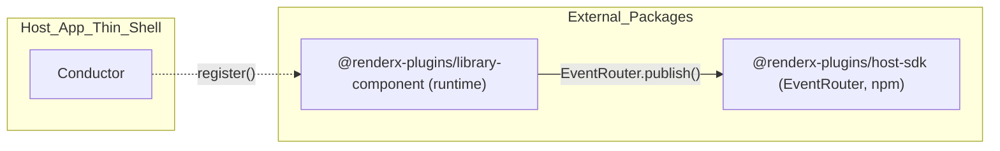

# ADR-0027 — Library-Component Externalization: Drag/Drop Runtime via Host SDK

Status: Proposed
Date: 2025-09-10
Relates to: #122

## Context
- The Header and Library plugins are now externalized and loaded via package specifiers in the host manifest.
- The Library-Component runtime (drag start, component drop, container drop) still lives in this repo under `plugins/library-component` and is referenced by JSON sequences via repo-relative handler paths.
- The Host SDK (`@renderx-plugins/host-sdk`) is the established boundary for plugins to publish/subscribe runtime events (e.g., `EventRouter.publish`).
- To maintain consistent boundaries and simplify maintenance, the Library-Component runtime should be externalized as an npm package and consumed via package specifier with a single `register(conductor)` entrypoint.

## Decision
- Create `@renderx-plugins/library-component` as a standalone runtime-only plugin package.
- Export `async function register(conductor)` that registers:
  - `library.component.drag.start` sequence (handlers: `onDragStart`)
  - `library.component.drop` sequence (handlers: `publishCreateRequested`)
  - `library.container.drop` sequence (handlers: `publishCreateRequested`)
- Use only the Host SDK at runtime (e.g., `EventRouter.publish`) — no cross-plugin imports or host-internal imports.
- Update the host manifest to reference the runtime via package specifier. JSON interactions keep existing topic keys and plugin ids.
- Enforce ESLint boundary rules (no cross-plugin imports) in both the host and the external package repos.

## Architecture (Mermaid)


## Future Structures (ASCII)
```
renderx-plugins-demo/                    # host repo
├─ json-interactions/
│  ├─ library.json                       # routes to Library + Library-Component ids
│  ├─ library-component.json             # drag/drop routes
│  └─ library-container.json             # container drop routes
├─ json-sequences/
│  └─ library-component/                 # kept for documentation; registration from package
├─ json-plugins/
│  └─ plugin-manifest.json               # runtime module -> @renderx-plugins/library-component
└─ ...

# External package repo (consumed via npm)
renderx-plugin-library-component/
├─ package.json (exports ./dist/index.js; sideEffects)
├─ src/
│  ├─ index.ts                           # export async function register(conductor)
│  └─ symphonies/
│     ├─ drag.symphony.ts                # handlers.onDragStart
│     ├─ drop.symphony.ts                # handlers.publishCreateRequested
│     └─ drop.container.symphony.ts      # handlers.publishCreateRequested
└─ dist/
```

## Plan (Phases)
1) Temporary In-Repo Package
- Create `/packages/renderx-plugin-library-component` workspace package.
- Move handlers and implement `register(conductor)`.
- Update manifest to reference workspace package specifier for runtime.
- Add unit tests (handlers, registration) and manifest validation.
- Ensure boundary ESLint rule passes (no cross-plugin imports).

2) Pre-release npm Package
- Publish `0.x` prerelease (e.g., `0.1.0-rc.0`), validate via `npm pack`/verdaccio.
- Verify `dist` exports (ESM/types) and `sideEffects` configuration.

3) Host Switches to npm Package
- Switch manifest runtime module to `@renderx-plugins/library-component`.
- Ensure runtime loaders/prebundle entries are correct (if applicable).
- E2E smoke: drag ghost + component/container drop flows pass.

4) Split Repo and Cleanup
- Create standalone repo (or confirm existing) and stabilize CI.
- Remove the temporary workspace package from this host repo.
- Maintain semver discipline; publish stable `0.1.x`.

## Tests (Minimum Suite)
- Unit: drag start ghost handling (deterministic), drop publishes topics with correct payloads/correlation id.
- Registration: `register(conductor)` wires expected plugin ids and sequences.
- Packaging: `dist/index.js` exports (ESM/types), `sideEffects` works, importable via specifier.
- Manifest/host compatibility: host can load runtime via specifier and route to registered sequences.
- Linting: boundary rule active (no host internals, no cross-plugin imports).

## Consequences
- Clear separation of concerns: UI (Library) vs. runtime interactions (Library-Component), each independently versioned and tested.
- Reduced coupling and improved portability of runtime logic across hosts.
- Slight overhead in manifest/runtime loader configuration; mitigated by tests and soak period.

## Risks & Mitigations
- Specifier loading failures → Add prebundle/runtime loader entries; E2E smoke and soak verification.
- Plugin id/route drift → Keep existing ids and topic names; assert in tests.
- Test flakiness (drag preview) → Keep tests DOM-light and deterministic; avoid timing-sensitive logic.
- History migration complexity → Use `git subtree`/`git filter-repo` where needed; backup and verify.

## References
- #122 — Decouple Library-Component: Externalize @renderx-plugins/library-component and Enforce Boundaries
- ADR-0023 — Host SDK and Plugin Decoupling
- ADR-0025 — Externalizing Plugins to NPM Packages, Aggregated Manifests, and Sequence Handling
- ADR-0026 — Library Decoupling — Host-owned Inventory and Externalized Library Plugin
- docs/RenderX Plugins Demo — Three-Slot Thin Shell (No Fallbacks) — Full Spec.md
