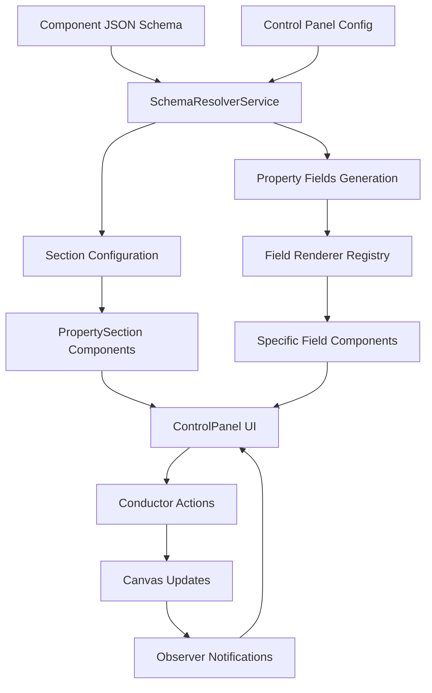

# Control Panel Scalable Architecture

## 🎯 Overview

The Control Panel has been transformed from a monolithic 384-line component into a highly scalable, data-driven architecture that reduces the main component to just 82 lines while dramatically improving maintainability, extensibility, and performance.

## 🏗️ Architecture Principles

### **1. Separation of Concerns**
Each module has a single, well-defined responsibility:
- **Hooks**: State management and side effects
- **Components**: Pure UI rendering
- **Services**: Business logic and data processing
- **Utils**: Reusable helper functions
- **Types**: TypeScript interfaces and type definitions

### **2. Data-Driven Configuration**
Properties and UI are generated from JSON schemas rather than hardcoded:
- Component schemas define available properties
- Configuration files control UI behavior
- Universal properties (layout, styling) are always available
- Component-specific overrides customize the experience

### **3. Modular Composition**
The main component only handles orchestration:
- Imports specialized modules
- Composes UI from reusable components
- Coordinates data flow between modules
- No inline business logic or component definitions

## 📁 File Structure

```
plugins/control-panel/
├── config/
│   └── control-panel.schema.json          # UI configuration schema
├── types/
│   └── control-panel.types.ts             # TypeScript interfaces
├── services/
│   └── schema-resolver.service.ts          # Schema-to-UI conversion
├── state/
│   ├── observer.store.ts                   # Observer pattern store
│   └── control-panel.reducer.ts           # State reducer logic
├── hooks/
│   ├── useControlPanelState.ts            # State management hook
│   ├── useSchemaResolver.ts               # Schema loading hook
│   └── useControlPanelActions.ts          # Action handlers hook
├── components/
│   ├── field-renderers/
│   │   ├── index.ts                       # Field renderer registry
│   │   ├── TextInput.tsx                  # Text field component
│   │   ├── NumberInput.tsx                # Number field component
│   │   ├── SelectInput.tsx                # Select dropdown component
│   │   ├── CheckboxInput.tsx              # Checkbox component
│   │   └── ColorInput.tsx                 # Color picker component
│   ├── layout/
│   │   ├── PanelHeader.tsx                # Panel header component
│   │   ├── EmptyState.tsx                 # No selection state
│   │   └── LoadingState.tsx               # Loading indicator
│   └── sections/
│       ├── PropertySection.tsx            # Collapsible property section
│       ├── PropertyFieldRenderer.tsx      # Individual field renderer
│       └── ClassManager.tsx               # CSS class management
├── utils/
│   └── field.utils.ts                     # Field manipulation utilities
└── ui/
    ├── ControlPanel.tsx                   # 🎯 Main component (82 lines)
    └── ControlPanel.css                   # Styles
```

## 🔄 Data Flow Architecture



## 🎛️ Key Components

### **1. SchemaResolverService**
**Purpose**: Converts JSON component schemas into UI field definitions

**Key Methods**:
- `generatePropertyFields()`: Creates field definitions from component schema
- `generateSections()`: Configures section layout and behavior
- `validateField()`: Provides real-time field validation

**Example Usage**:
```typescript
const resolver = new SchemaResolverService(config);
await resolver.loadComponentSchemas(['button', 'input']);
const fields = resolver.generatePropertyFields(selectedElement);
```

### **2. Field Renderer System**
**Purpose**: Extensible system for rendering different field types

**Registry Pattern**:
```typescript
const FIELD_RENDERERS = {
  TextInput,
  NumberInput,
  SelectInput,
  CheckboxInput,
  ColorInput
};

// Easy to extend
registerFieldRenderer('date', DateInput);
```

### **3. State Management**
**Purpose**: Centralized state with reducer pattern

**State Structure**:
```typescript
interface ControlPanelState {
  selectedElement: SelectedElement | null;
  currentClasses: string[];
  expandedSections: Set<string>;
  validationErrors: Record<string, string[]>;
  isDirty: boolean;
}
```

### **4. Configuration-Driven UI**
**Purpose**: JSON-based UI configuration for flexibility

**Schema Example**:
```json
{
  "defaultSections": [
    {
      "id": "content",
      "title": "📝 CONTENT",
      "order": 1,
      "collapsible": true,
      "defaultExpanded": true
    }
  ],
  "fieldTypes": {
    "text": {
      "component": "TextInput",
      "validation": ["string"]
    }
  }
}
```

## 🚀 Scalability Features

### **1. Easy Feature Addition**

**New Field Type**:
```typescript
// 1. Create component
export const DateInput: React.FC<FieldRendererProps> = ({ field, value, onChange }) => {
  // Implementation
};

// 2. Register
registerFieldRenderer('date', DateInput);

// 3. Use in schema
{ "type": "date", "component": "DateInput" }
```

**New Component Support**:
```json
// Add to json-components/my-component.json
{
  "integration": {
    "properties": {
      "schema": {
        "myProperty": { "type": "string", "required": true }
      }
    }
  }
}
```

### **2. Component-Specific Customization**
```json
{
  "componentTypeOverrides": {
    "button": {
      "sections": {
        "content": {
          "fields": ["content", "variant", "size"]
        },
        "advanced": {
          "title": "🔧 Advanced",
          "fields": ["customProperty"]
        }
      }
    }
  }
}
```

### **3. Universal Properties**
Always available regardless of component type:
- **Layout**: x, y, width, height
- **Styling**: bg-color, text-color, border-radius, font-size
- **Classes**: CSS class management

## 📊 Performance Benefits

### **Before vs After**

| Metric | Before | After | Improvement |
|--------|--------|-------|-------------|
| **Lines of Code** | 384 | 82 | 78% reduction |
| **Bundle Size** | Monolithic | Modular + lazy loading | Smaller bundles |
| **Re-renders** | Entire panel | Granular components | Better performance |
| **Memory Usage** | All components loaded | On-demand loading | Reduced memory |
| **Development** | Single file | Modular development | Faster iteration |

### **Optimization Techniques**
- **Memoization**: Expensive operations cached with `useMemo`
- **Lazy Loading**: Field renderers loaded on demand
- **Granular Updates**: Only affected components re-render
- **Efficient State**: Reducer pattern with immutable updates

## 🔧 Extension Points

### **1. Custom Field Renderers**
```typescript
interface CustomSliderProps extends FieldRendererProps {
  field: PropertyField & { min?: number; max?: number; step?: number };
}

export const CustomSlider: React.FC<CustomSliderProps> = ({ field, value, onChange }) => {
  return (
    <input
      type="range"
      min={field.min || 0}
      max={field.max || 100}
      step={field.step || 1}
      value={value}
      onChange={(e) => onChange(Number(e.target.value))}
    />
  );
};
```

### **2. Custom Validation Rules**
```typescript
const customValidation = {
  type: 'custom',
  validator: (value: any) => value.length >= 3,
  message: 'Must be at least 3 characters'
};
```

### **3. Section Plugins**
```typescript
export const AdvancedSection: React.FC<SectionProps> = ({ selectedElement }) => {
  // Custom section implementation
  return <div className="advanced-section">...</div>;
};
```

## 🎯 Best Practices

### **1. Component Development**
- Keep components pure and focused
- Use TypeScript for type safety
- Implement proper error boundaries
- Follow React best practices

### **2. State Management**
- Use reducer pattern for complex state
- Keep state normalized
- Implement optimistic updates
- Handle loading and error states

### **3. Performance**
- Memoize expensive computations
- Use React.memo for pure components
- Implement virtual scrolling for large lists
- Lazy load non-critical components

### **4. Testing**
- Unit test individual components
- Integration test hook interactions
- Mock external dependencies
- Test error scenarios

## 🔮 Future Enhancements

### **Phase 1: Advanced Field Types**
- Date/time pickers
- Rich text editors
- File upload components
- Multi-select dropdowns

### **Phase 2: Advanced Features**
- Conditional field visibility
- Field dependencies and validation
- Bulk property operations
- Undo/redo system

### **Phase 3: Collaboration**
- Real-time property editing
- Change conflict resolution
- Property change history
- Team collaboration features

### **Phase 4: AI Integration**
- Smart property suggestions
- Auto-completion based on context
- Property validation with AI
- Design system recommendations

## 📝 Migration Guide

### **From Legacy to New Architecture**

1. **Identify Reusable Components**: Extract inline components
2. **Create Custom Hooks**: Move state logic to hooks
3. **Implement Services**: Extract business logic
4. **Add Type Safety**: Define TypeScript interfaces
5. **Configure Schema**: Set up JSON configuration
6. **Test Incrementally**: Verify each migration step

### **Adding New Components**

1. **Create Component Schema**: Define in `json-components/`
2. **Add Field Renderers**: If new field types needed
3. **Configure Overrides**: Customize sections if needed
4. **Test Integration**: Verify with existing system
5. **Document Changes**: Update architecture docs

This scalable architecture provides a solid foundation for the Control Panel to grow from supporting a few component types to hundreds, while maintaining excellent performance and developer experience.
