# OgraphX Self-Orchestration Diagrams

This document contains three powerful visualizations of OgraphX's self-observation:

## 1. Summary Diagram

**What it shows**: High-level overview of the entire self-observation system.

- **IR Layer**: 31 Symbols, 283 Calls, 19 Contracts
- **Sequence Layer**: 31 Sequences, 31 Movements, 4000 Beats
- **Musical Notation**: Key (C Major), Tempo (100 BPM), Dynamics (pp to mf)

```mermaid
graph TB
    A["🧘 OgraphX Self-Observation"]
    
    B["📊 IR Layer<br/>31 Symbols<br/>283 Calls<br/>19 Contracts"]
    C["🎼 Sequence Layer<br/>31 Sequences<br/>31 Movements<br/>4000 Beats"]
    
    D["🎵 Musical Notation"]
    E["Key: C Major"]
    F["Tempo: 100 BPM"]
    G["Dynamics: pp to mf"]
    
    A --> B
    A --> C
    C --> D
    D --> E
    D --> F
    D --> G
    
    style A fill:#4CAF50,stroke:#2E7D32,color:#fff,font-weight:bold,font-size:16px
    style B fill:#2196F3,stroke:#1565C0,color:#fff
    style C fill:#9C27B0,stroke:#6A1B9A,color:#fff
    style D fill:#FF9800,stroke:#E65100,color:#fff
    style E fill:#F44336,stroke:#C62828,color:#fff
    style F fill:#F44336,stroke:#C62828,color:#fff
    style G fill:#F44336,stroke:#C62828,color:#fff
```



---

## 2. Orchestration Diagram

**What it shows**: The hierarchical structure of sequences, movements, and beats.

- **Root**: OgraphX Self-Orchestration
- **Category**: ANALYSIS (31 sequences)
- **Sequences**: Each exported symbol becomes a sequence
- **Movements**: Each sequence has a "calls" movement
- **Beats**: Each beat represents a function call

Example: `normalize_type` Flow
- Beat 1: call:normalize_type
- Beat 2: call:sub
- Beat 3: call:strip

```mermaid
graph TD
    Root["🧘 OgraphX Self-Orchestration"]

    Cat0["ANALYSIS<br/>31 sequences"]
    Root --> Cat0

    Seq0["Symbol<br/>Flow<br/>Tempo: 100"]
    Cat0 --> Seq0
    Mov0_0["Movement: calls<br/>1 beats"]
    Seq0 --> Mov0_0
    Beat0_0_0["Beat 1: noop<br/>pp"]
    Mov0_0 --> Beat0_0_0
    
    Seq4["normalize_type<br/>Flow<br/>Tempo: 100"]
    Cat0 --> Seq4
    Mov4_0["Movement: calls<br/>3 beats"]
    Seq4 --> Mov4_0
    Beat4_0_0["Beat 1: normalize_type<br/>mf"]
    Mov4_0 --> Beat4_0_0
    Beat4_0_1["Beat 2: sub<br/>mf"]
    Mov4_0 --> Beat4_0_1
    Beat4_0_2["Beat 3: strip<br/>mf"]
    Mov4_0 --> Beat4_0_2
    
    NoteCat0["... +26 more sequences"]
    Cat0 --> NoteCat0

    style Root fill:#4CAF50,stroke:#2E7D32,color:#fff,font-weight:bold
    classDef category fill:#2196F3,stroke:#1565C0,color:#fff
    classDef sequence fill:#9C27B0,stroke:#6A1B9A,color:#fff
    classDef movement fill:#FF9800,stroke:#E65100,color:#fff
    classDef beat fill:#F44336,stroke:#C62828,color:#fff
```



---

## 3. Call Graph Diagram

**What it shows**: The network of symbols and function calls.

- **Classes** (📦): Symbol, CallEdge, Contract, IR, etc.
- **Functions** (⚙️): normalize_type, extract_imports, extract_symbols_and_calls, etc.
- **Edges**: Function calls with labels


---

## The Meditation

These three diagrams represent the three layers of OgraphX's self-awareness:

1. **Summary**: The big picture—what is being observed
2. **Orchestration**: The structure—how it's organized
3. **Call Graph**: The relationships—how it all connects

Together, they form a complete picture of the tool observing itself.

---

## Generated Files

- `summary_diagram.md` - Summary visualization
- `orchestration_diagram.md` - Full orchestration hierarchy
- `call_graph_diagram.md` - Call graph network
- `generate_orchestration_diagram.py` - Script to regenerate diagrams

To regenerate all diagrams:
```bash
python generate_orchestration_diagram.py
```

