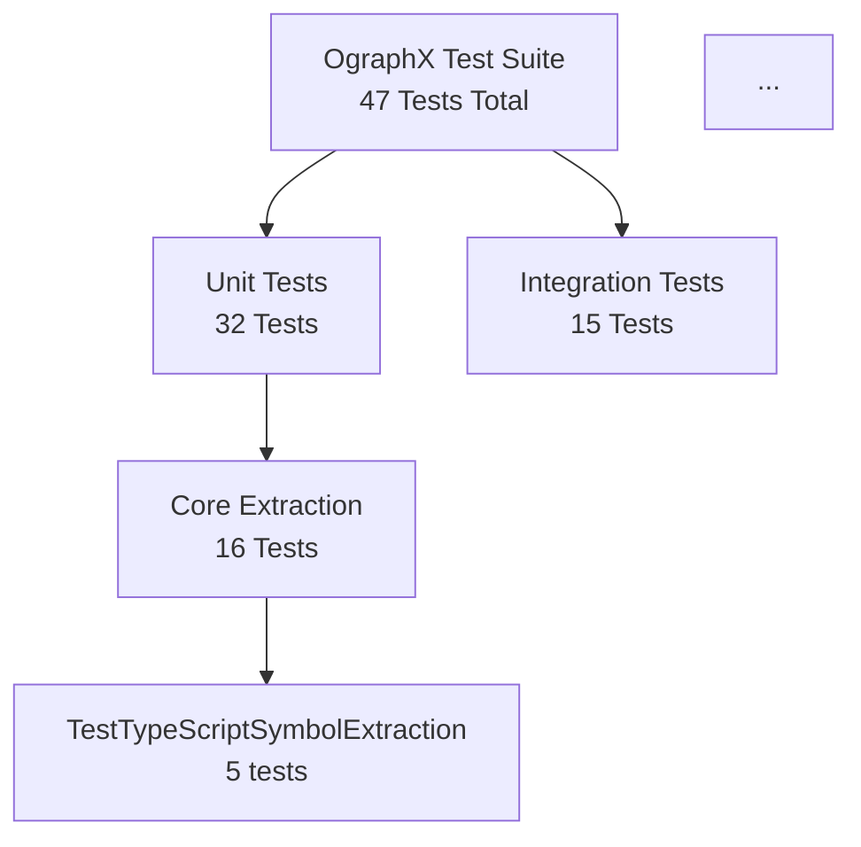

# Test Graph Generation - Automated Pipeline

## Overview

The test graph is **automatically generated from the actual test files** by the pipeline, not manually created. This ensures:

✅ **Reproducibility**: Same source → Same graph  
✅ **Consistency**: Graph always reflects actual tests  
✅ **Automation**: No manual updates needed  
✅ **Self-Aware**: OgraphX analyzes its own tests  

## Architecture

### Generation Pipeline

```
Test Files (*.py)
    ↓
generate_test_graph.py (analyzer)
    ↓
test_structure.json (data)
    ↓
test_graph.mmd (visualization)
    ↓
Rendered Diagram (display)
```

### Key Components

**1. Test Analyzer** (`generators/generate_test_graph.py`)
- Parses test files using regex patterns
- Extracts test classes and methods
- Builds hierarchical structure
- Generates JSON and Mermaid outputs

**2. Test Structure** (`.ographx/test-graphs/test_structure.json`)
- Complete test hierarchy in JSON format
- Includes class names, methods, descriptions
- Test counts and categorization
- Single source of truth for test metadata

**3. Test Graph** (`.ographx/test-graphs/test_graph.mmd`)
- Mermaid diagram definition
- Generated from test_structure.json
- Automatically rendered in documentation
- Shows test hierarchy visually

## Generated Outputs

### test_structure.json

```json
{
  "unit": {
    "Core Extraction": [
      {
        "name": "TestTypeScriptSymbolExtraction",
        "description": "Test TypeScript symbol extraction",
        "methods": [
          {
            "name": "test_extract_function_declarations",
            "description": "Test extraction of function declarations"
          },
          ...
        ],
        "count": 5
      },
      ...
    ],
    "Generators": [...]
  },
  "integration": {
    "Pipeline": [...]
  },
  "total_tests": 47,
  "files": [...]
}
```

### test_graph.mmd



## Test Statistics

| Category | Tests | Status |
|----------|-------|--------|
| Core Extraction | 16 | ✅ Ready |
| Generators | 16 | ✅ Ready |
| Pipeline Integration | 15 | ✅ Ready |
| **Total** | **47** | ✅ Ready |

### Test Breakdown

**Unit Tests (32)**
- Core Extraction: 16 tests
  - Symbol Extraction: 5 tests
  - Call Resolution: 2 tests
  - Contract Extraction: 2 tests
  - Import Graphs: 2 tests
  - Type Handling: 2 tests
  - IR Validation: 3 tests

- Generators: 16 tests
  - Sequence Generation: 3 tests
  - Diagram Generation: 4 tests
  - SVG Conversion: 3 tests
  - Contract Validation: 3 tests
  - Pipeline Integration: 3 tests

**Integration Tests (15)**
- Full Pipeline: 6 tests
- Data Flow Validation: 4 tests
- Error Handling: 3 tests
- Pipeline Consistency: 2 tests

## Running Test Graph Generation

### Manual Execution

```bash
cd packages/ographx
python generators/generate_test_graph.py
```

### Automated (via regeneration pipeline)

```bash
python generators/regenerate_all.py
```

This runs all generation steps including test graph generation.

## Integration with CI/CD

The test graph generation can be integrated into CI/CD pipelines:

```yaml
# Example GitHub Actions
- name: Generate Test Graph
  run: |
    cd packages/ographx
    python generators/generate_test_graph.py
    
- name: Commit Test Graph
  run: |
    git add .ographx/test-graphs/
    git commit -m "chore: regenerate test graph"
```

## Self-Aware Testing

The test graph generation demonstrates OgraphX's self-awareness:

1. **Self-Analysis**: OgraphX analyzes its own test suite
2. **Self-Documentation**: Tests document themselves
3. **Self-Validation**: Graph validates test structure
4. **Self-Improvement**: Metrics inform test improvements

## Extending Test Graph Generation

To add new test categories:

1. Add test files to `tests/unit/` or `tests/integration/`
2. Follow naming convention: `test_<category>.py`
3. Use docstrings for class and method descriptions
4. Run `generate_test_graph.py` to regenerate
5. Graph automatically updates

## Files

- **Generator**: `generators/generate_test_graph.py`
- **Output (JSON)**: `.ographx/test-graphs/test_structure.json`
- **Output (Mermaid)**: `.ographx/test-graphs/test_graph.mmd`
- **Documentation**: `docs/TEST_GRAPH_GENERATION.md`

## Key Principles

✅ **Pipeline-Driven**: Generated by pipeline, not manual  
✅ **Reproducible**: Same input → Same output  
✅ **Consistent**: Always reflects actual tests  
✅ **Automated**: No manual updates needed  
✅ **Self-Aware**: OgraphX analyzes itself  
✅ **Extensible**: Easy to add new tests  

---

**Status**: ✅ Implemented  
**Version**: 1.0  
**Date**: 2025-11-12

