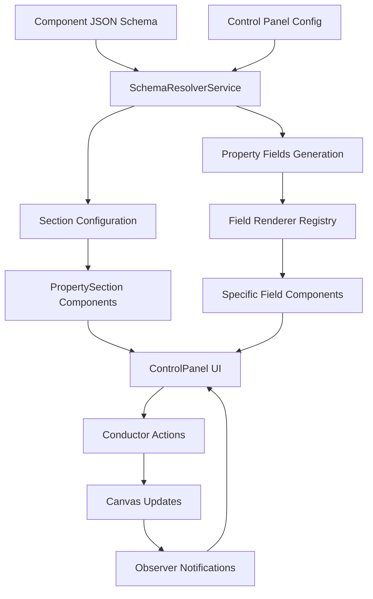

# Control Panel Scaling Architecture

## 🎯 Overview

This document outlines the scalable, data-driven architecture for the Control Panel that addresses current limitations and provides a foundation for future growth.

## 🚨 Current Problems Solved

### 1. **Hardcoded Configuration** ❌ → **Data-Driven Schema** ✅
- **Before**: Property sections hardcoded in React component
- **After**: JSON schema configuration with component-specific overrides

### 2. **Monolithic Structure** ❌ → **Modular Architecture** ✅
- **Before**: Single 300+ line file with mixed concerns
- **After**: Separated services, components, types, and configuration

### 3. **Limited Extensibility** ❌ → **Plugin System** ✅
- **Before**: Adding field types requires code changes
- **After**: Extensible field renderer system with registration

### 4. **No Component Integration** ❌ → **Schema-Driven** ✅
- **Before**: Disconnected from JSON component definitions
- **After**: Automatically generates UI from component schemas

## 📁 New File Structure

```
plugins/control-panel/
├── config/
│   └── control-panel.schema.json          # Main configuration schema
├── types/
│   └── control-panel.types.ts             # TypeScript interfaces
├── services/
│   └── schema-resolver.service.ts          # Core schema resolution logic
├── components/
│   ├── field-renderers/
│   │   ├── index.ts                       # Field renderer registry
│   │   ├── TextInput.tsx                  # Text field component
│   │   ├── NumberInput.tsx                # Number field component
│   │   ├── SelectInput.tsx                # Select dropdown component
│   │   ├── CheckboxInput.tsx              # Checkbox component
│   │   ├── ColorInput.tsx                 # Color picker component
│   │   ├── RangeInput.tsx                 # Range slider component
│   │   ├── TextareaInput.tsx              # Textarea component
│   │   └── FileInput.tsx                  # File upload component
│   ├── sections/
│   │   ├── PropertySection.tsx            # Collapsible property section
│   │   ├── ClassManager.tsx               # CSS class management
│   │   └── ValidationSummary.tsx          # Validation error display
│   └── layout/
│       ├── PanelHeader.tsx                # Panel header component
│       ├── EmptyState.tsx                 # No selection state
│       └── LoadingState.tsx               # Loading indicator
├── hooks/
│   ├── useControlPanelState.ts            # State management hook
│   ├── useSchemaResolver.ts               # Schema resolution hook
│   └── useControlPanelActions.ts          # Action handlers hook
├── utils/
│   ├── validation.utils.ts                # Validation helpers
│   ├── schema.utils.ts                    # Schema manipulation utilities
│   └── field.utils.ts                     # Field-specific utilities
├── ui/
│   ├── ControlPanel.tsx                   # Current implementation
│   ├── ControlPanel.v2.tsx                # New data-driven implementation
│   └── ControlPanel.css                   # Styles
├── state/
│   └── observer.store.ts                  # Existing observer store
├── symphonies/                            # Existing symphony handlers
└── index.ts                               # Plugin exports
```

## 🔄 Data Flow Architecture



## 🎛️ Configuration-Driven Features

### 1. **Dynamic Field Generation**
```json
{
  "integration": {
    "properties": {
      "schema": {
        "content": {
          "type": "string",
          "default": "Click me",
          "description": "Button text content",
          "required": true
        },
        "variant": {
          "type": "string",
          "enum": ["primary", "secondary", "danger"],
          "default": "primary"
        }
      }
    }
  }
}
```

### 2. **Component-Specific Overrides**
```json
{
  "componentTypeOverrides": {
    "button": {
      "sections": {
        "content": {
          "fields": ["content", "variant", "size", "disabled"]
        },
        "styling": {
          "fields": ["bg-color", "text-color", "border-radius"]
        }
      }
    }
  }
}
```

### 3. **Extensible Field Types**
```typescript
// Register custom field renderer
registerFieldRenderer('custom-slider', CustomSliderComponent);

// Use in schema
{
  "fieldTypes": {
    "custom-slider": {
      "component": "CustomSliderComponent",
      "validation": ["number"],
      "props": { "min": 0, "max": 100 }
    }
  }
}
```

## 🚀 Scaling Benefits

### **1. Easy Feature Addition**
- **New Field Types**: Just add renderer component and register
- **New Sections**: Update configuration JSON
- **Component Support**: Add JSON schema file

### **2. Maintainability**
- **Separation of Concerns**: Each file has single responsibility
- **Type Safety**: Full TypeScript coverage
- **Testability**: Isolated, mockable components

### **3. Performance**
- **Lazy Loading**: Field renderers loaded on demand
- **Memoization**: Expensive operations cached
- **Efficient Re-renders**: Granular state updates

### **4. Developer Experience**
- **Hot Reloading**: Configuration changes without restart
- **Validation**: Real-time field validation
- **Documentation**: Self-documenting schema

## 🔧 Migration Strategy

### Phase 1: Foundation (Current)
- ✅ Create new file structure
- ✅ Implement core services and types
- ✅ Build basic field renderers
- ✅ Create data-driven ControlPanel.v2.tsx

### Phase 2: Integration
- 🔄 Test new implementation alongside current
- 🔄 Migrate existing functionality
- 🔄 Add validation and error handling
- 🔄 Performance optimization

### Phase 3: Enhancement
- ⏳ Add advanced field types (date, rich text, etc.)
- ⏳ Implement conditional fields
- ⏳ Add bulk operations
- ⏳ Create component-specific plugins

### Phase 4: Advanced Features
- ⏳ Real-time collaboration
- ⏳ Undo/redo system
- ⏳ Custom themes
- ⏳ Advanced validation rules

## 📊 Comparison: Before vs After

| Aspect | Before | After |
|--------|--------|-------|
| **Lines of Code** | 296 lines | ~100 lines main component |
| **Extensibility** | Hard-coded | Configuration-driven |
| **Type Safety** | Partial | Complete TypeScript |
| **Testing** | Monolithic | Isolated components |
| **Performance** | Re-renders entire panel | Granular updates |
| **Maintainability** | Single file | Modular architecture |
| **Component Integration** | None | Automatic from JSON |
| **Validation** | Basic | Comprehensive |
| **Field Types** | 4 types | Unlimited extensible |

## 🎯 Next Steps

1. **Test the new implementation** with existing components
2. **Gradually migrate** features from old to new
3. **Add missing field renderers** (Range, Textarea, File)
4. **Implement advanced validation** system
5. **Create component-specific plugins** for complex controls
6. **Add performance monitoring** and optimization
7. **Build comprehensive test suite**

This architecture provides a solid foundation for scaling the control panel to support hundreds of component types and thousands of properties while maintaining excellent performance and developer experience.
