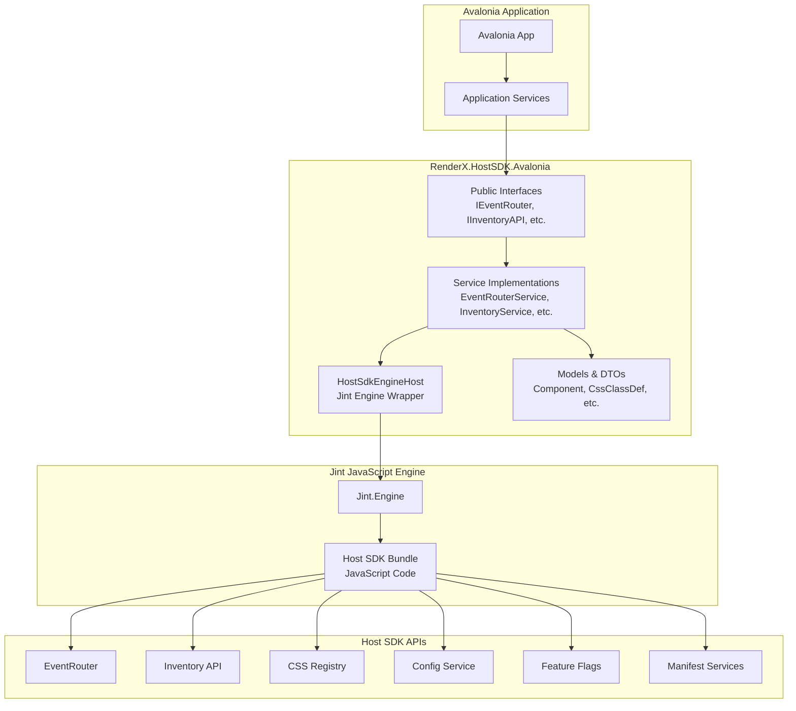

# RenderX.HostSDK.Avalonia - Architecture Guide

## Overview

This document describes the architecture of the RenderX.HostSDK.Avalonia integration, which embeds the TypeScript RenderX Host SDK in a .NET/Avalonia desktop application using the Jint JavaScript engine.

## Architecture Diagram



## Component Layers

### 1. Public API Layer (Interfaces)

**Purpose**: Define the contract for Host SDK functionality accessible to .NET applications.

**Components**:
- `IEventRouter` - Topic-based pub/sub messaging
- `IInventoryAPI` - Component inventory management
- `ICssRegistryAPI` - CSS class registry
- `IConfigService` - Configuration access
- `IFeatureFlagsService` - Feature flag management
- `IPluginManifestService` - Plugin discovery
- `IInteractionManifestService` - Interaction routing
- `ITopicsManifestService` - Topics manifest access

**Design Principles**:
- Async-first API design (Task-based)
- IDisposable for subscriptions
- Nullable reference types enabled
- XML documentation on all public members

### 2. Models & DTOs

**Purpose**: Provide strongly-typed C# representations of JavaScript objects.

**Components**:
- `ComponentSummary`, `Component` - Inventory models
- `CssClassDef` - CSS class definition
- `FlagStatus`, `FlagMeta` - Feature flag models
- `HostPluginManifestEntry`, `HostPluginManifest` - Plugin manifest
- `Route` - Routing information
- `TopicDefinition`, `TopicPerformanceConfig` - Topic configuration

**Design Principles**:
- Required properties use `required` keyword
- Optional properties use nullable types
- Immutable where appropriate
- JSON-serializable

### 3. Service Implementation Layer

**Purpose**: Implement the public interfaces by bridging to JavaScript.

**Components** (Phase 2+):
- `EventRouterService` - Implements IEventRouter
- `InventoryService` - Implements IInventoryAPI
- `CssRegistryService` - Implements ICssRegistryAPI
- `ConfigService` - Implements IConfigService
- `FeatureFlagsService` - Implements IFeatureFlagsService
- `PluginManifestService` - Implements IPluginManifestService
- `InteractionManifestService` - Implements IInteractionManifestService
- `TopicsManifestService` - Implements ITopicsManifestService

**Design Principles**:
- Singleton lifetime (registered in DI)
- Dependency on HostSdkEngineHost
- Error handling and logging
- Type conversion between C# and JavaScript

### 4. Engine Layer

**Purpose**: Manage the Jint JavaScript engine and provide bridge utilities.

**Components**:
- `HostSdkEngineHost` - Main engine wrapper
  - Initializes Jint engine
  - Loads Host SDK bundle
  - Provides browser API stubs
  - Exposes type conversion utilities
  - Manages engine lifecycle

**Key Methods**:
- `CallEventRouterMethod(string methodName, params object[] args)` - Call EventRouter methods
- `CallInventoryMethod(string methodName, params object[] args)` - Call Inventory methods
- `CallCssRegistryMethod(string methodName, params object[] args)` - Call CSS Registry methods
- `GetGlobalObject(string path)` - Access JavaScript globals
- `ConvertToJsValue(object? obj)` - Convert C# to JavaScript
- `ConvertFromJsValue<T>(JsValue value)` - Convert JavaScript to C#

**Design Principles**:
- Single instance per application
- Lazy initialization
- Resource cleanup (IDisposable)
- Comprehensive logging

### 5. JavaScript Bundle

**Purpose**: Embedded TypeScript Host SDK compiled to JavaScript.

**Location**: `Resources/host-sdk-bundle.js` (embedded resource)

**Contents**:
- EventRouter implementation
- Inventory API
- CSS Registry API
- Config service
- Feature flags
- Manifest services

**Loading**:
- Loaded from embedded resources at startup
- Fallback to stub implementation if bundle not found
- Executed in Jint engine context

### 6. Dependency Injection

**Purpose**: Register all services in the .NET DI container.

**Components**:
- `ServiceCollectionExtensions` - Extension methods for IServiceCollection
- `HostSdkOptions` - Configuration options

**Registration**:
```csharp
services.AddRenderXHostSdk(options =>
{
    options.EnableDebugLogging = true;
    options.OperationTimeoutMs = 10000;
});
```

**Lifetime**:
- All services registered as Singletons
- HostSdkEngineHost is the root singleton
- All other services depend on HostSdkEngineHost

### 7. Exception Handling

**Purpose**: Provide specific exception types for error scenarios.

**Components**:
- `HostSdkException` - Base exception
- `JsBridgeException` - JavaScript bridge errors
- `TopicNotFoundException` - Topic not found
- `ComponentNotFoundException` - Component not found
- `CssClassNotFoundException` - CSS class not found

**Design Principles**:
- Inherit from HostSdkException
- Include relevant context (e.g., topic key, component ID)
- Preserve inner exceptions

## Data Flow

### Subscription Flow (C# → JavaScript)

```
1. C# calls IEventRouter.Subscribe("my.topic", handler)
2. EventRouterService calls HostSdkEngineHost.CallEventRouterMethod("subscribe", "my.topic", handler)
3. HostSdkEngineHost converts C# handler to JavaScript function
4. Jint executes window.RenderX.EventRouter.subscribe("my.topic", jsHandler)
5. JavaScript EventRouter stores subscription
6. Returns unsubscribe function wrapped in IDisposable
```

### Publish Flow (C# → JavaScript → C# Handlers)

```
1. C# calls IEventRouter.PublishAsync("my.topic", payload)
2. EventRouterService calls HostSdkEngineHost.CallEventRouterMethod("publish", "my.topic", payload)
3. HostSdkEngineHost converts C# payload to JavaScript object
4. Jint executes window.RenderX.EventRouter.publish("my.topic", jsPayload)
5. JavaScript EventRouter invokes all subscribed handlers
6. JavaScript handlers call back into C# via Jint bridge
7. C# handlers receive payload (converted back to C#)
```

### Async API Call Flow (C# → JavaScript → Promise → C#)

```
1. C# calls IInventoryAPI.ListComponentsAsync()
2. InventoryService calls HostSdkEngineHost.CallInventoryMethod("listComponents")
3. Jint executes window.RenderX.inventory.listComponents()
4. JavaScript returns Promise
5. HostSdkEngineHost awaits Promise resolution
6. JavaScript result converted to C# List<ComponentSummary>
7. Task<IReadOnlyList<ComponentSummary>> completes
```

## Type Conversion

### C# to JavaScript

| C# Type | JavaScript Type |
|---------|----------------|
| `string` | `string` |
| `int`, `long`, `double` | `number` |
| `bool` | `boolean` |
| `null` | `null` |
| `object`, `Dictionary` | `object` |
| `List`, `Array` | `array` |
| `Action<T>` | `function` |
| `Task<T>` | `Promise<T>` |

### JavaScript to C#

| JavaScript Type | C# Type |
|----------------|---------|
| `string` | `string` |
| `number` | `double` (or cast to int/long) |
| `boolean` | `bool` |
| `null`, `undefined` | `null` |
| `object` | `Dictionary<string, object>` or POCO |
| `array` | `List<T>` or `T[]` |
| `function` | `Func<T>` or `Action<T>` |
| `Promise<T>` | `Task<T>` |

## Performance Considerations

### Latency

- **C# → JavaScript call**: ~0.5-2ms
- **JavaScript → C# callback**: ~0.5-2ms
- **Round-trip (C# → JS → C#)**: ~1-4ms

### Memory

- **Jint Engine**: ~5-10MB base
- **Host SDK Bundle**: ~100-500KB
- **Per-subscription overhead**: ~1-2KB

### Optimization Strategies

1. **Minimize cross-boundary calls** - Batch operations when possible
2. **Cache frequently accessed data** - Store in C# rather than querying JS
3. **Use async APIs** - Avoid blocking the UI thread
4. **Dispose subscriptions** - Clean up event handlers to prevent leaks

## Threading Model

### Jint Engine

- **Single-threaded** - All JavaScript execution on one thread
- **Not thread-safe** - Synchronize access if called from multiple threads

### Service Implementations

- **Thread-safe** - Services can be called from any thread
- **Synchronization** - Use locks when accessing Jint engine
- **Async/await** - Properly handle async operations

### Avalonia UI

- **UI thread** - Avalonia controls must be accessed on UI thread
- **Dispatcher** - Use Dispatcher.UIThread.InvokeAsync for UI updates
- **Background work** - Offload heavy operations to background threads

## Security Considerations

### JavaScript Execution

- **Sandboxed** - Jint provides isolated execution environment
- **No file system access** - JavaScript cannot access file system directly
- **No network access** - JavaScript cannot make network requests directly
- **Controlled APIs** - Only exposed APIs are accessible

### Input Validation

- **Validate all inputs** - Check parameters before passing to JavaScript
- **Sanitize strings** - Prevent injection attacks
- **Type checking** - Ensure correct types before conversion

## Testing Strategy

### Unit Tests

- Test each service in isolation
- Mock HostSdkEngineHost
- Test type conversions
- Test error handling

### Integration Tests

- Test full stack (C# → Jint → JavaScript → C#)
- Test async operations
- Test subscriptions and callbacks
- Test resource cleanup

### Performance Tests

- Measure call latency
- Measure memory usage
- Test under load
- Profile bottlenecks

## Future Enhancements

### Phase 2: Core APIs

- Implement EventRouter, Inventory, CSS Registry services
- Add comprehensive error handling
- Add performance monitoring

### Phase 3: Configuration

- Implement Config and Feature Flags services
- Add provider pattern support
- Add runtime configuration updates

### Phase 4: Manifests

- Implement all manifest services
- Add caching strategies
- Add hot-reload support

### Phase 5: Advanced Features

- Add TypeScript source map support for debugging
- Add performance profiling tools
- Add hot-reload for JavaScript bundle
- Add plugin system for extensibility

## References

- [Jint Documentation](https://github.com/sebastienros/jint)
- [Avalonia Documentation](https://docs.avaloniaui.net/)
- [MusicalConductor.Avalonia](../MusicalConductor.Avalonia/ARCHITECTURE.md) - Reference implementation
- [RenderX Host SDK](../README.md) - TypeScript source

